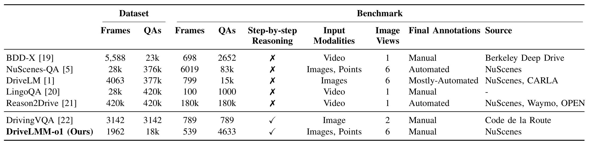
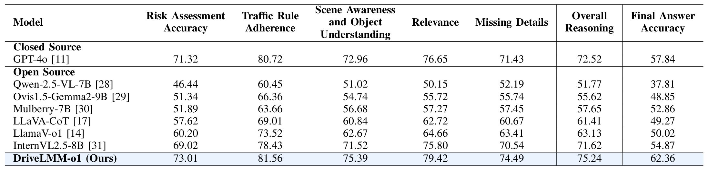

<h2 align="center">DriveLMM-o1: A Step-by-Step Reasoning Dataset and Large Multimodal Model for Driving Scenario Understanding</h2>


[](https://arxiv.org/abs/2503.10621v1)

[Ayesha Ishaq](https://github.com/ayesha-ishaq), [Jean Lahoud](https://scholar.google.com/citations?user=LsivLPoAAAAJ&hl=en), [Ketan More](https://github.com/mbzuai-oryx/DriveLMM-o1), [Omkar Thawakar](https://omkarthawakar.github.io/), [Ritesh Thawkar](https://github.com/mbzuai-oryx/DriveLMM-o1), [Dinura Dissanayake](https://github.com/mbzuai-oryx/DriveLMM-o1), [Noor Ahsan](https://github.com/mbzuai-oryx/DriveLMM-o1), [Yuhao Li](https://github.com/mbzuai-oryx/DriveLMM-o1),  [Fahad Shahbaz Khan](https://scholar.google.es/citations?user=zvaeYnUAAAAJ&hl=en), [Hisham Cholakkal](https://scholar.google.com/citations?hl=en&user=bZ3YBRcAAAAJ), [Ivan Laptev](https://mbzuai.ac.ae/study/faculty/ivan-laptev/), [Rao Muhammad Anwer](https://scholar.google.com/citations?hl=en&authuser=1&user=_KlvMVoAAAAJ) and [Salman Khan](https://salman-h-khan.github.io/) 


**Mohamed bin Zayed University of Artificial Intelligence, UAE**

<h5 align="center"> If you like our project, please give us a star ⭐ on GitHub for the latest updates.</h5>

---

## 📣 Latest Updates
- **March-13-2025**: DriveLMM-o1 is released on Arxiv. [Paper](https://arxiv.org/abs/2503.10621v1)
- **March-12-2025**: *Code, Model & Dataset release.* Model Checkpoint: [HuggingFace](https://huggingface.co/ayeshaishaq/DriveLMMo1). Dataset: [HuggingFace](https://huggingface.co/datasets/ayeshaishaq/DriveLMMo1). Code is available at: [GitHub](https://github.com/mbzuai-oryx/DriveLMM-o1). 🤗

---

## 🏆 Contributions
- **We introduce a dataset and benchmark** specifically designed to assess the reasoning capabilities of models in autonomous driving, capturing diverse real-world scenarios.
- **We annotate driving scenes** that inherently contain rich inputs, including multiview images, LiDAR point clouds, and temporal information, facilitating the integration of various modalities for future VQA solutions.
- **We propose a novel evaluation metric** tailored to autonomous driving, measuring the logical coherence and accuracy of model-generated explanations.
- **We evaluate previous open-source and closed-source models** on our proposed benchmark and introduce a model trained on our step-by-step reasoning dataset. Experimental results show that our model outperforms all models in both reasoning score and final accuracy.
---

## 📂 Dataset Overview
<div align=center>

</div>

DriveLMM-o1 dataset includes diverse real-world driving scenarios with structured reasoning annotations. It provides a rich benchmark for evaluating autonomous driving LMMs.

### Dataset Examples
<div align=center>

</div>

---

## 📊 Benchmark & Results
### Results Overview
**Table 1:** Comparison of models based on Final Answer accuracy and Driving-Specific Reasoning Steps Metrics on DriveLMM-o1 Benchmark.

<div align=center>

</div>

---

## ⚙️ Model Setup 
### Load Pretrained Model
```python
from transformers import AutoModel, AutoTokenizer
import torch

path = 'ayeshaishaq/DriveLMMo1'
model = AutoModel.from_pretrained(
    path,
    torch_dtype=torch.bfloat16,
    low_cpu_mem_usage=True,
    use_flash_attn=True,
    trust_remote_code=True
).eval().cuda()

tokenizer = AutoTokenizer.from_pretrained(
    path,
    trust_remote_code=True,
    use_fast=False
)
```

---

## 🏃 Inference
To run inference on our model, add the relevant image path to `evaluation/demo.py` and run:
```bash
python evaluation/demo.py
```

---

## 📏 Evaluation
To reproduce our results, first convert our test set to jsonl format using:
```bash
python evaluation/prepare_data_internvl.py
```
set the relevent data paths.

then, obtain model output on our test set using `evaluation/inference.py`,
```bash
torchrun --nnodes=1 \
         --node_rank=0 \
         --master_addr=127.0.0.1 \
         --nproc_per_node=4 \
         --master_port=63668 \
         evaluation/inference.py
```
lastly, set the output file path in `evaluation/evaluation.py` and your OpenAI key and run:
```bash
python evaluation/evaluation.py
```

---

## 📚 Dataset & Model Links
- **Model on Hugging Face:** [DriveLMM-o1 Model](https://huggingface.co/ayeshaishaq/DriveLMMo1)
- **Dataset on Hugging Face:** [DriveLMM-o1 Dataset](https://huggingface.co/datasets/ayeshaishaq/DriveLMMo1)

---


## 📜 Citation
If you find this work useful, please cite our paper:
```bibtex
@misc{ishaq2025drivelmmo1stepbystepreasoningdataset,
      title={DriveLMM-o1: A Step-by-Step Reasoning Dataset and Large Multimodal Model for Driving Scenario Understanding}, 
      author={Ayesha Ishaq and Jean Lahoud and Ketan More and Omkar Thawakar and Ritesh Thawkar and Dinura Dissanayake and Noor Ahsan and Yuhao Li and Fahad Shahbaz Khan and Hisham Cholakkal and Ivan Laptev and Rao Muhammad Anwer and Salman Khan},
      year={2025},
      eprint={2503.10621},
      archivePrefix={arXiv},
      primaryClass={cs.CV},
      url={https://arxiv.org/abs/2503.10621}, 
}
```

